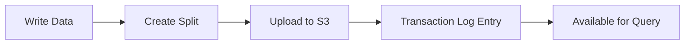

# Split Architecture

IndexTables uses a split-based architecture optimized for cloud object storage.

## What is a Split?

A **split** is a self-contained index segment stored as a single file (`.split`) in object storage. Each split contains:

- Inverted index data
- Document store
- Fast fields (columnar data)
- Metadata

## Why Splits?

Traditional search engines use many small files per index segment. This works well for local SSDs but is inefficient for object storage like S3 where:

- Each file requires a separate HTTP request
- Small files waste storage (minimum object sizes)
- Listing operations are expensive

The QuickwitSplit format consolidates everything into a single file, optimizing for cloud storage patterns.

## Split Lifecycle



1. **Write**: Data is indexed in memory
2. **Create**: Index is serialized to QuickwitSplit format
3. **Upload**: Split file is uploaded to object storage
4. **Commit**: Transaction log records the new split
5. **Query**: Split is now visible to readers

## Split Files

Splits are stored with UUID-based names:

```
s3://bucket/my_index/
  _transaction_log/
    manifests/
      manifest-a1b2c3d4.avro
    state-v.../
      _manifest.json
  partition=2024-01-01/
    abc123-def456-789.split
    xyz789-abc123-456.split
```

## Maintenance

Over time, many small splits accumulate. Use `MERGE SPLITS` to consolidate:

```sql
MERGE SPLITS 's3://bucket/my_index' TARGET SIZE 4G;
```

See [MERGE SPLITS](/docs/sql-commands/merge-splits) for details.
